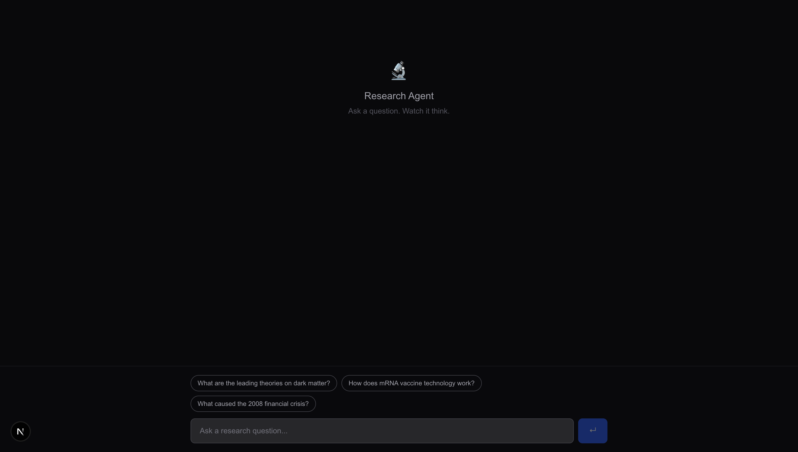
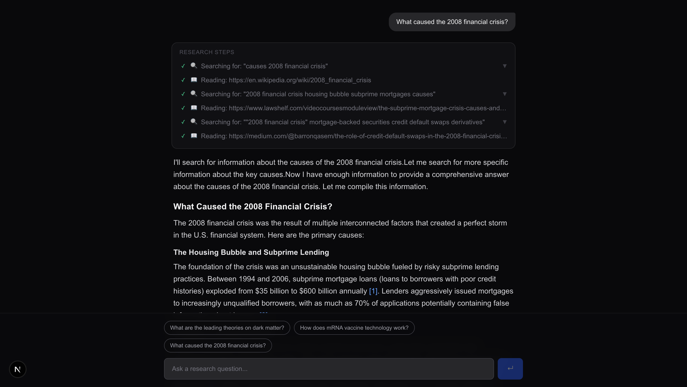

# Research Agent

An autonomous research assistant that searches the web, reads sources, and streams a synthesized answer with inline citations — built from scratch without any agent framework.
> Built with Claude.

---





---

## How it works

The agent implements the **ReAct loop** (Reason + Act) by hand using the Anthropic SDK's `tool_use` feature. There is no LangChain, no LangGraph, no agent framework — the loop is ~100 lines of TypeScript in `lib/agent.ts`.

**The loop, step by step:**

1. The user's question is sent to Claude along with two tool definitions: `search` and `read`.
2. Claude decides whether to answer directly or call a tool first.
3. If Claude calls `search`, the agent hits the Tavily API and returns a list of results (title, URL, snippet).
4. If Claude calls `read`, the agent fetches the URL via Jina Reader and returns the page content as clean markdown.
5. The tool result is appended to the message history and sent back to Claude.
6. Claude decides again: call another tool, or synthesize a final answer.
7. Steps 3–6 repeat until Claude produces a text response (stop reason `end_turn`), capped at 10 tool calls.

The final answer streams token-by-token to the browser. Thinking steps (what the agent searched for, what it read) are shown in real time and stay expandable after the answer completes.

```
User question
    │
    ▼
Claude (with search + read tools)
    │
    ├─► tool_use: search("...") ──► Tavily API ──► 5 results
    │         ◄── tool_result ──────────────────────────────
    │
    ├─► tool_use: read("https://...") ──► Jina Reader ──► markdown
    │         ◄── tool_result ──────────────────────────────
    │
    └─► text: "Here is what I found..." (streams to browser)
```

---

## Stack

| Layer | Choice | Why |
|-------|--------|-----|
| Frontend | Next.js 15 (App Router), TypeScript | App Router is the current standard; fills the React/TypeScript gap |
| Streaming | Custom `ReadableStream` + `fetch` | Hand-rolled to match the custom JSON-line stream format |
| Agent LLM | Anthropic Claude via `@anthropic-ai/sdk` | Clean `tool_use` API; shows range beyond OpenAI |
| Search tool | Tavily Search API | Purpose-built for LLM agents; returns pre-extracted content |
| Read tool | Jina Reader API (`r.jina.ai`) | Converts any URL to clean markdown; no scraping infrastructure |
| Styling | Tailwind CSS | Utility-first; no component library overhead |
| Package manager | pnpm | Fast, disk-efficient |

---

## Local setup

**Prerequisites:** Node 18+, pnpm, an Anthropic API key, and a Tavily API key.

```bash
# 1. Clone the repo
git clone https://github.com/lukehurt/streaming-research-agent.git
cd streaming-research-agent

# 2. Install dependencies
pnpm install

# 3. Add your API keys
cp .env.example .env.local
```

Open `.env.local` and fill in your keys:

```
ANTHROPIC_API_KEY=sk-ant-...
TAVILY_API_KEY=tvly-...
JINA_API_KEY=            # optional — free tier works without a key
```

- **Anthropic API key:** [console.anthropic.com](https://console.anthropic.com)
- **Tavily API key:** [app.tavily.com](https://app.tavily.com) — free tier includes 1,000 searches/month
- **Jina API key:** [jina.ai](https://jina.ai) — optional, raises rate limits

```bash
# 4. Start the dev server
pnpm dev
```

Open [http://localhost:3000](http://localhost:3000).

> **Note:** There is no hosted version of this app. Running it requires your own API keys. Each research query makes 3–8 API calls (1–2 Tavily searches + 2–4 Jina reads + the Claude calls that drive the loop).

---

## Project structure

```
lib/
  agent.ts      # The ReAct loop (~100 lines, no framework)
  tools.ts      # Tool definitions Claude uses to decide what to call
  tavily.ts     # Tavily search client
  jina.ts       # Jina Reader client
  types.ts      # Shared TypeScript interfaces

app/
  api/chat/
    route.ts    # POST handler — streams JSON lines from the agent loop
  page.tsx      # Single page

components/
  chat.tsx          # State + stream reader
  message.tsx       # Markdown renderer with citation linking
  thinking-step.tsx # Expandable agent step (search / read / reasoning)
  sources-panel.tsx # All consulted sources with favicons
  search-input.tsx  # Query input bar
```
